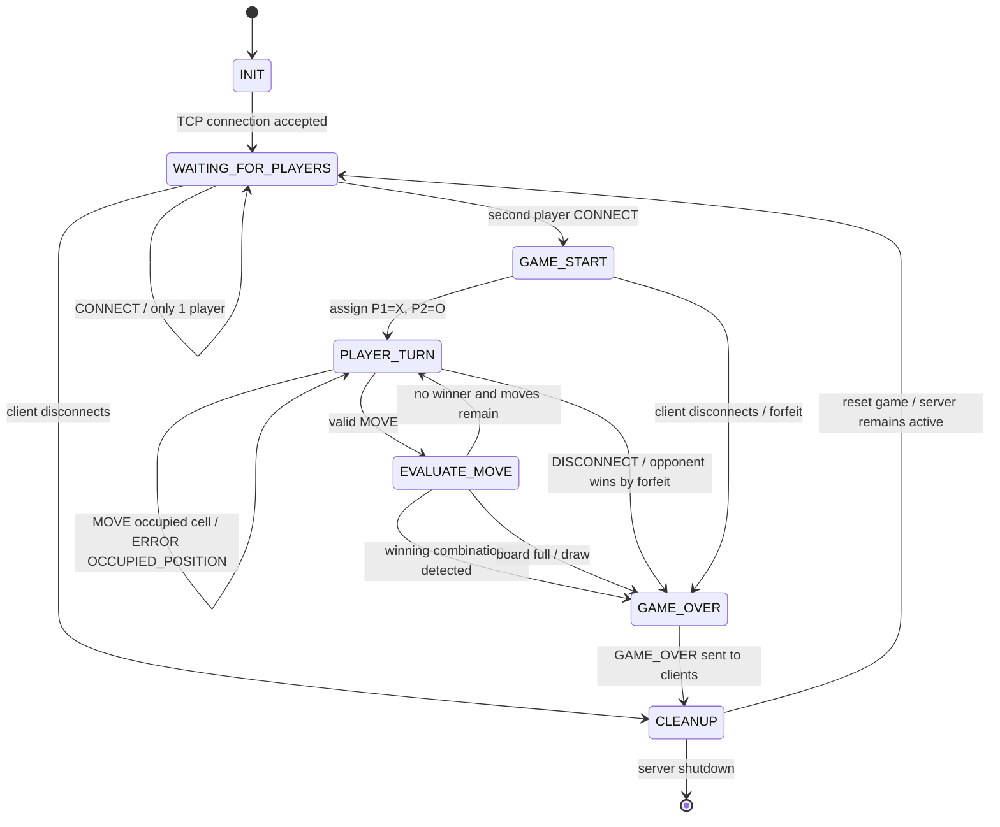

# JSON-Based Tic-Tac-Toe Finite State Machine Specification

## 1. Overview

The Tic-Tac-Toe server uses a finite state machine (FSM) to control the lifecycle of every game.

The server-side states are:

1. `INIT`
2. `WAITING_FOR_PLAYERS`
3. `GAME_START`
4. `PLAYER_TURN`
5. `EVALUATE_MOVE`
6. `GAME_OVER`
7. `CLEANUP`

The server is authoritative and controls all transitions.

Client requests cannot directly change the server's state. A client sends a JSON message, and the server determines whether that message produces a valid state transition.

---

# 2. Mermaid State Diagram

The following diagram uses Mermaid `stateDiagram-v2` syntax.



---

# 3. State Definitions

## 3.1 INIT

### Purpose

`INIT` represents the initial state of a newly accepted client connection.

### Responsibilities

The server:

1. Accepts the TCP connection.
2. Creates a client/session record.
3. Initializes the client's receive buffer.
4. Waits for a `CONNECT` message.

### Transition

```text
INIT
  |
  | TCP connection accepted
  v
WAITING_FOR_PLAYERS
```

---

# 3.2 WAITING_FOR_PLAYERS

### Purpose

The server is waiting for enough clients to form a two-player game.

### Responsibilities

The server maintains a lobby containing connected clients that have successfully sent `CONNECT`.

### One Player

If only one player is available:

```text
WAITING_FOR_PLAYERS
       |
       | CONNECT
       v
WAITING_FOR_PLAYERS
```

The server sends:

```json
{
  "type": "LOBBY_WAIT",
  "game_id": "game-001",
  "player_id": "server",
  "payload": {
    "players_waiting": 1
  }
}
```

### Second Player

When a second player connects:

```text
WAITING_FOR_PLAYERS
       |
       | second CONNECT
       v
GAME_START
```

The server creates the game and assigns:

```text
Player 1 -> X
Player 2 -> O
```

Player 1 receives the first turn.

---

# 3.3 GAME_START

### Purpose

Initializes the game.

### Responsibilities

The server:

1. Creates a nine-position empty board.
2. Assigns Player 1.
3. Assigns Player 2.
4. Assigns `X` to Player 1.
5. Assigns `O` to Player 2.
6. Sets the current turn to Player 1.
7. Sends `GAME_START` to both players.

### Transition

```text
GAME_START
     |
     | roles assigned
     v
PLAYER_TURN
```

---

# 3.4 PLAYER_TURN

### Purpose

Waits for the current player to submit a move.

The server tracks:

```text
current_turn = player_id
```

Only the player identified by `current_turn` may successfully submit a `MOVE`.

### Valid Move

A valid `MOVE` causes:

```text
PLAYER_TURN
     |
     | valid MOVE
     v
EVALUATE_MOVE
```

### Out-of-Turn Move

If the wrong player sends a move:

```text
PLAYER_TURN
     |
     | MOVE from non-current player
     v
PLAYER_TURN
```

The server sends:

```json
{
  "type": "ERROR",
  "game_id": "game-001",
  "player_id": "server",
  "payload": {
    "code": "OUT_OF_TURN",
    "message": "It is not your turn."
  }
}
```

The server does not crash, close the connection, or modify the board.

---

# 3.5 Invalid Move Handling

A move is invalid if:

* The position is less than `0`.
* The position is greater than `8`.
* The selected position is already occupied.
* The game has already ended.
* The sender is not a player in the game.
* It is not the sender's turn.

Invalid moves transition back to `PLAYER_TURN`.

### Invalid Position

```text
PLAYER_TURN
     |
     | position < 0 or position > 8
     v
ERROR
     |
     v
PLAYER_TURN
```

### Occupied Position

```text
PLAYER_TURN
     |
     | selected cell already occupied
     v
ERROR
     |
     v
PLAYER_TURN
```

### Out-of-Turn Move

```text
PLAYER_TURN
     |
     | wrong player sends MOVE
     v
ERROR
     |
     v
PLAYER_TURN
```

`ERROR` is an application-level response and does not represent a persistent FSM state.

---

# 4. EVALUATE_MOVE

### Purpose

Determines what happened after a valid move.

After placing the player's symbol, the server checks:

1. Whether the player has three symbols in a row.
2. Whether the board is completely full.
3. Whether another turn remains.

### Winner

If a winning combination exists:

```text
EVALUATE_MOVE
     |
     | winning combination
     v
GAME_OVER
```

### Draw

If all nine positions are occupied and nobody has won:

```text
EVALUATE_MOVE
     |
     | board full
     v
GAME_OVER
```

### Continue Game

If no winner exists and empty positions remain:

```text
EVALUATE_MOVE
     |
     | no winner, board not full
     v
PLAYER_TURN
```

The server changes:

```text
current_turn = other_player
```

and sends a `STATE_UPDATE` to both players.

---

# 5. GAME_OVER

### Purpose

Represents a completed game.

A game may end because:

* Player 1 wins.
* Player 2 wins.
* The board is full and the game is a draw.
* A player disconnects during the game and forfeits.

### Normal Win

The server sends:

```json
{
  "type": "GAME_OVER",
  "game_id": "game-001",
  "player_id": "server",
  "payload": {
    "result": "WIN",
    "winner": "player-001",
    "reason": "THREE_IN_A_ROW",
    "board": [
      "X",
      "X",
      "X",
      "O",
      "O",
      null,
      null,
      null,
      null
    ]
  }
}
```

### Draw

The server sends:

```json
{
  "type": "GAME_OVER",
  "game_id": "game-001",
  "player_id": "server",
  "payload": {
    "result": "DRAW",
    "winner": null,
    "reason": "BOARD_FULL",
    "board": [
      "X",
      "O",
      "X",
      "X",
      "O",
      "O",
      "O",
      "X",
      "X"
    ]
  }
}
```

After the result has been sent:

```text
GAME_OVER
     |
     | GAME_OVER delivered
     v
CLEANUP
```

---

# 6. Disconnect Handling

## 6.1 Graceful Disconnect

A client may intentionally leave by sending:

```json
{
  "type": "DISCONNECT",
  "game_id": "game-001",
  "player_id": "player-001",
  "payload": {
    "reason": "CLIENT_EXIT"
  }
}
```

### During a Game

If the client is playing:

```text
PLAYER_TURN
     |
     | DISCONNECT
     v
GAME_OVER
```

The remaining player wins by forfeit.

The server sends:

```json
{
  "type": "GAME_OVER",
  "game_id": "game-001",
  "player_id": "server",
  "payload": {
    "result": "FORFEIT",
    "winner": "player-002",
    "reason": "PLAYER_DISCONNECTED",
    "board": [
      "X",
      null,
      null,
      null,
      "O",
      null,
      null,
      null,
      null
    ]
  }
}
```

---

# 7. Abrupt Disconnect Handling

A client may disappear without sending `DISCONNECT`.

The server must detect the following conditions:

### TCP EOF

If:

```text
recv() == 0 bytes
```

the remote peer has closed its connection.

The server treats this as a client disconnect.

### TCP Reset

If a socket operation raises:

```text
ConnectionResetError
```

the server treats the client as disconnected.

### Failed Send

If sending a message raises:

```text
BrokenPipeError
```

the server treats the client as disconnected.

These conditions must not crash the entire server.

---

# 8. Abrupt Disconnect FSM Path

During an active game:

```text
PLAYER_TURN
     |
     | TCP EOF / RST / socket exception
     v
GAME_OVER
```

The server:

1. Marks the disconnected player as disconnected.
2. Declares the remaining player the winner by forfeit.
3. Sends `GAME_OVER` if the opponent is still connected.
4. Removes the disconnected client's socket.
5. Cleans up the game.

Then:

```text
GAME_OVER
     |
     v
CLEANUP
```

---

# 9. CLEANUP

### Purpose

Releases all resources associated with the completed game.

The server should:

1. Close disconnected client sockets.
2. Remove clients from the active game.
3. Remove the game from the active-game table.
4. Clear the board.
5. Clear player assignments.
6. Clear the current-turn value.
7. Return remaining connected clients to the lobby when appropriate.

### Subsequent Games

After cleanup, the server remains available for additional games.

Therefore:

```text
CLEANUP
     |
     | reset complete
     v
WAITING_FOR_PLAYERS
```

This allows the same server process to host multiple games sequentially.

---

# 10. Complete Game Lifecycle

The complete normal lifecycle is:

```text
INIT
  |
  v
WAITING_FOR_PLAYERS
  |
  | second player connects
  v
GAME_START
  |
  v
PLAYER_TURN
  |
  | valid MOVE
  v
EVALUATE_MOVE
  |
  +------ winner ------> GAME_OVER
  |
  +------ draw --------> GAME_OVER
  |
  +------ continue ----> PLAYER_TURN
                              |
                              | valid MOVE
                              v
                         EVALUATE_MOVE
                              |
                              v
                         ...
```

Eventually:

```text
GAME_OVER
    |
    v
CLEANUP
    |
    v
WAITING_FOR_PLAYERS
```

---

# 11. Error and Failure Lifecycle

Invalid client operations do not terminate the game.

```text
PLAYER_TURN
    |
    +-- invalid position ------> ERROR ------+
    |                                        |
    +-- occupied position -----> ERROR ------+
    |                                        |
    +-- out-of-turn ------------> ERROR -----+
                                             |
                                             v
                                       PLAYER_TURN
```

Abrupt disconnects terminate the affected game:

```text
PLAYER_TURN
    |
    | EOF / RST / ConnectionResetError
    v
GAME_OVER
    |
    | opponent wins by forfeit
    v
CLEANUP
```

---

# 12. FSM State Summary

| State                 | Purpose                              | Important Transitions                  |
| --------------------- | ------------------------------------ | -------------------------------------- |
| `INIT`                | Initialize newly accepted connection | `WAITING_FOR_PLAYERS`                  |
| `WAITING_FOR_PLAYERS` | Wait for two players                 | `GAME_START`, `CLEANUP`                |
| `GAME_START`          | Assign roles and initialize board    | `PLAYER_TURN`, `GAME_OVER`             |
| `PLAYER_TURN`         | Wait for current player's move       | `EVALUATE_MOVE`, `GAME_OVER`           |
| `EVALUATE_MOVE`       | Check winner/draw/continuation       | `PLAYER_TURN`, `GAME_OVER`             |
| `GAME_OVER`           | Report game result                   | `CLEANUP`                              |
| `CLEANUP`             | Release game resources/reset         | `WAITING_FOR_PLAYERS`, server shutdown |

---

# 13. Player Roles

Every game contains exactly two players.

| Role       | Symbol | First Turn |
| ---------- | ------ | ---------- |
| `PLAYER_1` | `X`    | Yes        |
| `PLAYER_2` | `O`    | No         |

The server determines the role assignment and includes it in `GAME_START`.

Clients cannot choose or change their symbol.

---

# 14. Server Authority

The server is the single source of truth for:

* Current board.
* Player assignments.
* Current turn.
* Valid moves.
* Winning combinations.
* Draw detection.
* Game result.
* Disconnect handling.
* Game cleanup.

A client must never be trusted to determine whether a move is legal.

For example, a malicious or buggy client could send:

```json
{
  "type": "MOVE",
  "game_id": "game-001",
  "player_id": "player-002",
  "payload": {
    "position": 0
  }
}
```

while it is actually Player 1's turn.

The server checks the session's authoritative `current_turn` value and returns:

```json
{
  "type": "ERROR",
  "game_id": "game-001",
  "player_id": "server",
  "payload": {
    "code": "OUT_OF_TURN",
    "message": "It is not your turn."
  }
}
```

The game continues normally.

---
